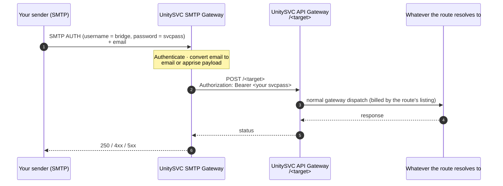

# SMTP-to-API-Gateway Bridge — `smtp-to-api-gateway`

Send an email; the UnitySVC SMTP gateway forwards it into a **route on the UnitySVC API Gateway** — a service, an alias, a broadcast group, or an enrollment — authenticated as **you**. Useful when something you operate can only emit email (monitoring agents, cron jobs, appliances, CI, backup tools) but the thing you want to reach is an HTTP service on the platform: your notification destination, a `msg-to-*` channel, a `/b/` fan-out, or any other listing.

You choose the route and the payload shape; UnitySVC handles the SMTP-to-HTTP plumbing and the credential hop. The host is always the platform's API Gateway — you only pick the path — so your API key is never forwarded off-platform.

## How it works



## Payload formats

| `payload_format` | Body POSTed to the route | Use it for |
|---|---|---|
| `email` | the faithful envelope — `from`, `to`, `subject`, `text_body`, `html_body`, allowlisted `headers`, base64 `attachments`, SPF/DKIM passthrough | routes that need the whole message: `http-to-smtp`, `http-to-smtp-gateway`, archival or parsing services, a `/b/` group whose legs accept `email` |
| `apprise` | the compact `{title, body, type, format}` envelope — subject → `title`, body → `body` | `notify`, any `msg-to-<channel>` service, a `/b/` group of `msg` legs. Attachments, HTML structure and custom headers are dropped. |

Be lossy as late as possible: if the route (or anything behind it) might need the original message, send `email`.

## Two ways to use this service

|                | `default` — stored route | `plus` — per-enrollment routes |
|----------------|--------------------------|--------------------------------|
| Best for       | one fixed destination    | many email-to-route bridges under one account |
| Route          | `SMTP_TO_API_GATEWAY_TARGET` customer secret (default `notify`) | a `target` parameter per enrollment |
| Payload format | `SMTP_TO_API_GATEWAY_FORMAT` customer secret (default `apprise`) | a `payload_format` parameter per enrollment (default `email`) |
| SMTP username  | `smtp-to-api-gateway`    | the enrollment's 6-character code |
| Price          | **free**                 | **$0.001 / email** ($1 per 1,000) |

The route's own listing bills whatever it bills in both cases; this bridge only meters the `plus` hop.

### Method 1 — Stored route (`default`, free)

With **no configuration at all**, the bridge forwards to `notify` as an `apprise` envelope — every email becomes a notification delivered to the destination you configured under Notifications. To point it elsewhere, set customer secrets:

- `SMTP_TO_API_GATEWAY_TARGET` — the route, relative to the API Gateway host: `msg-to-discord`, `a/alerts`, `b/relay`, `e/XXXXXX`, …
- `SMTP_TO_API_GATEWAY_FORMAT` — `email` or `apprise`

Then authenticate to the SMTP gateway and send a normal email:

| Setting  | Value |
|----------|-------|
| Host     | your gateway's SMTP host |
| Username | `smtp-to-api-gateway` |
| Password | your UnitySVC API key (`svcpass_…`) |

```bash
swaks --server "$SMTP_GATEWAY_HOST" \
      --auth-user smtp-to-api-gateway \
      --auth-password "$UNITYSVC_API_KEY" \
      --to anything@example.com \
      --header "Subject: Backup finished" \
      --body "Nightly backup completed in 4m12s."
```

Any `To:` address works — routing is by SMTP username, not recipient.

### Method 2 — Per-enrollment routes (`plus`, metered)

Run **multiple** bridges under one account — e.g. `alerts@…` → `notify`, `invoices@…` → an archival `/b/` group as `email`, `leads@…` → a CRM webhook behind `http-relay`. Each enrollment binds:

| Parameter        | Required | Meaning |
|------------------|----------|---------|
| `target`         | **yes**  | Route on the API Gateway, relative to the host: a service name, `a/<alias>`, `b/<group>`, `g/<group>`, `e/<code>`. No scheme, no leading slash. |
| `payload_format` | optional | `email` (default) or `apprise`. |

1. **Enroll, one per route**:

   ```json
   { "target": "notify", "payload_format": "apprise" }
   ```

   ```json
   { "target": "b/mail-archive", "payload_format": "email" }
   ```

   ```json
   { "target": "a/crm-inbound" }
   ```

   Each enrollment returns its own **6-character code** — that's the SMTP username for that bridge.

2. **Send mail through the right bridge** — the username selects the enrollment; the same svcpass authenticates every one:

   ```python
   import smtplib, os
   from email.message import EmailMessage

   def send(code, subject, body):
       msg = EmailMessage()
       msg["From"], msg["To"], msg["Subject"] = "ops@example.com", "route@unitysvc.com", subject
       msg.set_content(body)
       with smtplib.SMTP(os.environ["SMTP_GATEWAY_HOST"], int(os.environ["SMTP_GATEWAY_PORT"])) as s:
           s.starttls()
           s.login(code, os.environ["UNITYSVC_API_KEY"])
           s.send_message(msg)

   send("XXXXXX", "ALERT: api down", "p99 > 5s for 10m …")   # -> notify
   send("YYYYYY", "Invoice 2026-09", "see attached")          # -> b/mail-archive, faithful
   ```

## Credential handling

The gateway replays **your own** API key as the bearer token on the hop to the API Gateway (`auth_mode: forward`). The host is fixed to the platform's gateway and only the path is yours to choose, so the credential never leaves UnitySVC. The route then runs exactly as if you had POSTed to it yourself: same enrollment, same secrets, same billing.

## Related services

| You want | Use |
|---|---|
| email → your **own** HTTP receiver, faithful envelope | `smtp-to-http` |
| email → your **own** HTTP receiver, compact envelope | `smtp-to-msg` |
| email → your verified mailbox, no configuration | `smtp-to-mailbox` |
| email → your notification destination, no configuration | `notify` (SMTP channel) — what this bridge defaults to |
| HTTP → email, the other direction | `http-to-smtp`, `http-to-smtp-gateway` |

## Troubleshooting

- **SMTP `550` / route not found** — the `target` doesn't resolve for your account: check spelling, that you are enrolled in the target service, and that an alias/broadcast of that name exists and is enabled.
- **Route rejects the body (4xx from the target)** — payload-format mismatch: `notify` and `msg-to-*` want `apprise`; faithful consumers want `email`.
- **All `plus` emails hit the same route** — you used the wrong enrollment code as the SMTP username. Each bridge has its own.
- **Attachments missing at the destination** — you sent `apprise`; switch the bridge to `email`.
